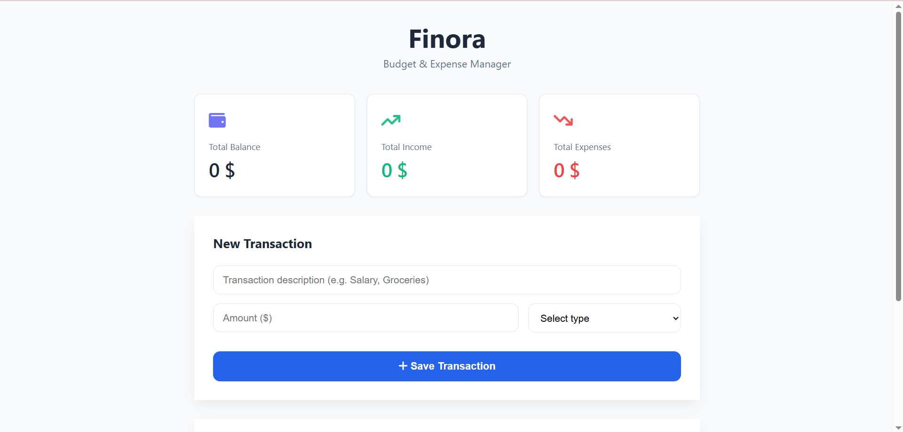

# Finora - Personal Finance Tracker

A lightweight web app to track personal income, expenses, and current balance.

## Demo & Usage

- **Live Demo:** [personal-finance-tracker-61926.vercel.app](https://personal-finance-tracker-61926.vercel.app/)
- **Local:** Download or clone the repo, then open `index.html` directly in any browser.

## Features

- Real-time summary cards (Balance, Total Income, Total Expense)
- Dynamic transaction form to add entries with categories
- Scrollable history log with option to delete individual entries
- Reset functionality (`Clear All`)
- Persistent state stored via browser `localStorage`

## Project Structure

- `index.html` - App structure and layouts
- `style.css` - Custom styling and responsive rules
- `script.js` - Dynamic DOM updates, event handling, and `localStorage` syncing

## Note for Reviewers (Hackatime Tracking)

This repository was initially created under the working directory name "weather" before switching focus to this finance tracker. All tracked time on Hackatime under "weather" represents work done on this repository.
